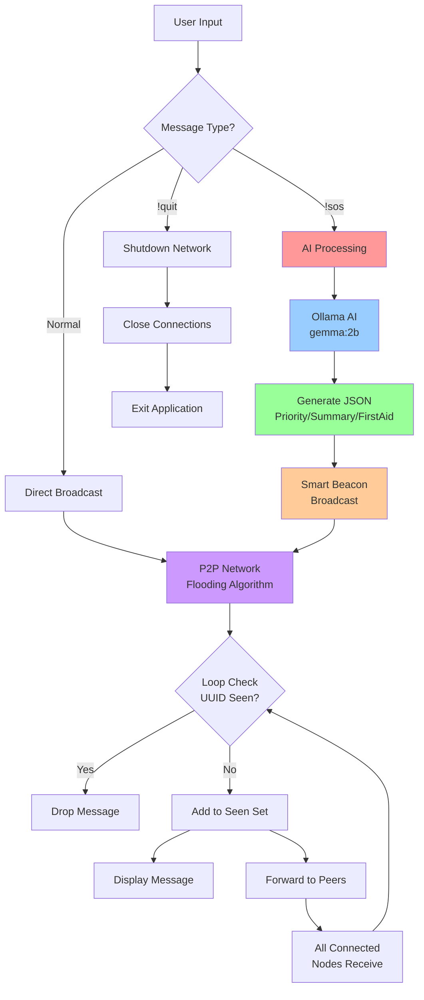

# MeshMate

In the critical hours following a disaster or infrastructure collapse, communication is the most vital asset. When the internet and cellular networks fail, communities are left isolated and vulnerable. MeshMate is a proof-of-concept that explores a robust solution to this problem: a serverless, offline-first communication network where devices connect directly to each other, forming a resilient P2P mesh.

This project demonstrates how such a network can not only relay messages but also leverage an onboard AI assistant to intelligently process, upgrade, and prioritize distress calls, turning chaotic information into actionable intelligence for first responders—all without needing a central server.

## Features

Decentralized P2P Networking: Nodes communicate directly over a simulated TCP socket network without a central server, creating a resilient and serverless architecture.

Intelligent Agent Processing: An AI-enabled node intercepts critical messages (e.g., !sos), preventing network spam and performing autonomous processing instead of just mindlessly relaying information.

On-Device AI Brain: Integrates a locally-run LLM (gemma:2b via Ollama) to provide intelligence, ensuring all AI processing happens on-device for maximum privacy and true offline capability.

"Smart Rescue Beacon" Generation: The core feature where a simple, natural language distress call is automatically analyzed by the AI and upgraded into a structured, machine-readable JSON data packet with priority, summary, and first-aid advice.

Loop Prevention: Implements a "seen messages" cache using unique message IDs (uuid) to prevent infinite broadcast storms in the flooding network.

Polished Terminal UI: Each node runs within an interactive and user-friendly Terminal User Interface (TUI) built with the modern Python textual library.
## Flowchart

The core logic of the network differentiates between standard messages and critical AI commands. A regular message is simply relayed to all peers. An !sos command, however, is intercepted by the first available AI-enabled node, which then processes it and broadcasts a new, structured "Smart Beacon" in its place.

## Technical Architecture

The project is built on several key architectural decisions designed to simulate a real-world, robust, and modern decentralized application.

Concurrency Model: The application relies on Python's built-in threading library to manage concurrent operations. Each primary network task (listening for new nodes, handling messages from a specific peer) runs in its own thread. This I/O-bound approach ensures that the main UI thread remains responsive and is never blocked by network latency.

Networking Protocol: The peer-to-peer connections are established using the standard socket library, implementing a TCP (Transmission Control Protocol) based network. TCP was chosen for its reliability and connection-oriented nature, guaranteeing message delivery between connected peers, which forms a solid foundation for the mesh's relay logic.

AI Integration: To fulfill the "offline-first" and "on-device" premise, the AI is integrated via the ollama library, which connects to a locally running Ollama server. The lightweight gemma:2b model was specifically chosen for its excellent balance of small footprint and powerful performance, making the concept of an onboard AI assistant feasible.

UI Framework: The user interface is built with Textual, a modern Terminal User Interface (TUI) framework. Instead of a simple print-based command line, Textual provides an event-driven application model, sophisticated layout and styling options via CSS, and, most critically, thread-safe methods (call_from_thread) for updating the UI from background networking threads without causing conflicts.
## Video

The following demo showcases the core functionality of MeshMate in a simulated three-node network.

In this demonstration, Node 1 sends a critical distress signal: !sos there is smoke coming from main building. The message is received by Node 2, which uses its onboard AI to autonomously process the alert.

The final, structured "Smart Beacon" is then broadcast to the entire network, intelligently converting a simple text message into actionable data for first responders.

https://github.com/user-attachments/assets/010e434d-ac35-42c3-8b88-ab2976d02814

## UI Mockup made using UX Pilot AI

## Future Scope

This project serves as a strong foundation for a full-featured emergency communication platform. Future development could focus on the following key areas:

True Mobile Implementation: Porting the core logic from a terminal simulation to a cross-platform mobile application (iOS/Android) using native networking APIs like Wi-Fi Direct and Bluetooth Low Energy for true device-to-device communication.

End-to-End Encryption (E2EE): Implementing a robust cryptographic layer (such as the Signal Protocol) to ensure all messages are private and secure, which is critical for use in sensitive environments.

Expanded AI Capabilities: Introducing more specialized AI commands beyond !sos, such as:

!need <item>: To request and track supplies like water, food, or medical kits.

!status: To provide structured check-ins for team members.

!translate <text>: For real-time, offline language translation between rescue teams.

Dynamic & Power-Aware Routing: Evolving the simple message flooding algorithm into a more intelligent routing protocol (like AODV or DSDV) that can find the most efficient path and make decisions based on node battery levels to preserve network health.

GUI with Map Integration: Creating a full graphical user interface that includes a map view to visualize the known locations of other nodes and geo-tag critical alerts and resources.
